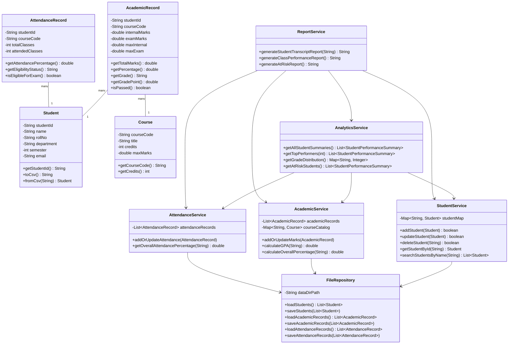
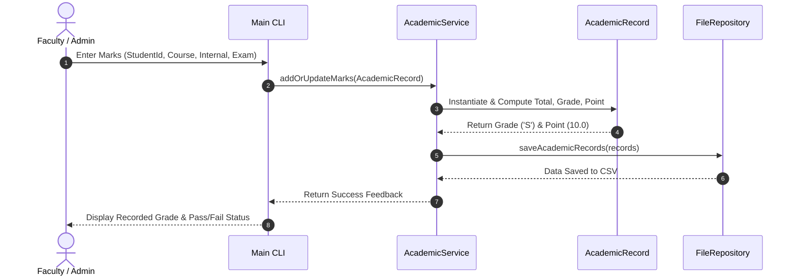
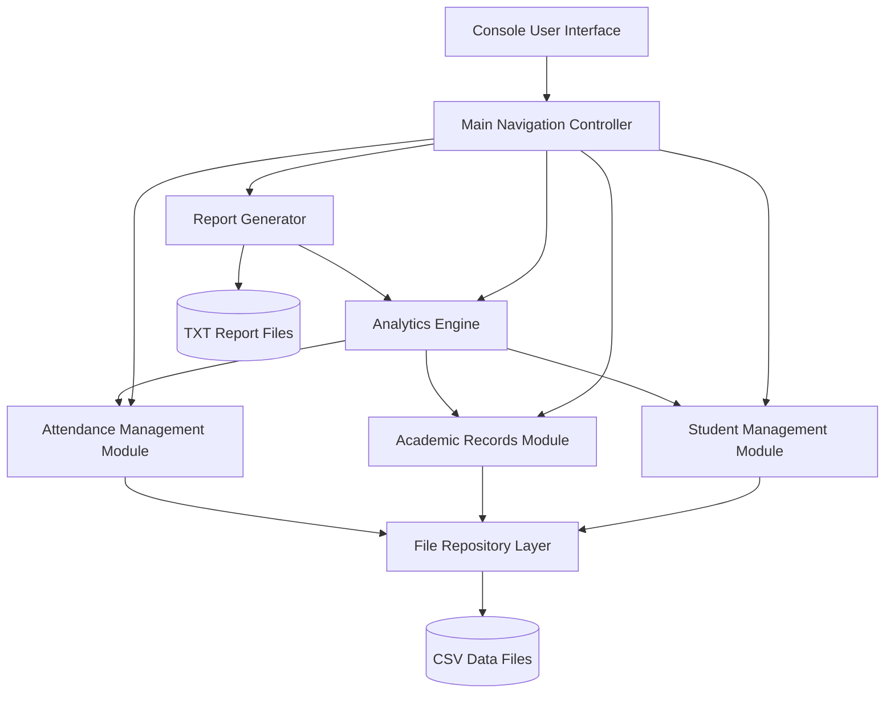
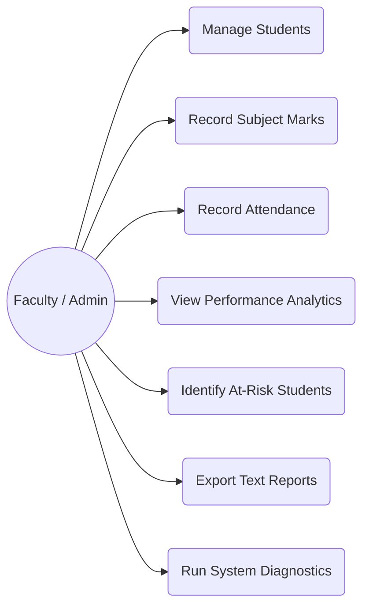

# System UML Diagrams

This document contains full UML specifications (Class Diagram, Sequence Diagram, Component Diagram, and Use Case Diagram) for the **Student Performance & Academic Analytics System**.

---

## 1. Class Diagram (UML)

---

## 2. Sequence Diagram (Marks Recording & GPA Calculation)

---

## 3. Component Diagram

---

## 4. Use Case Diagram

